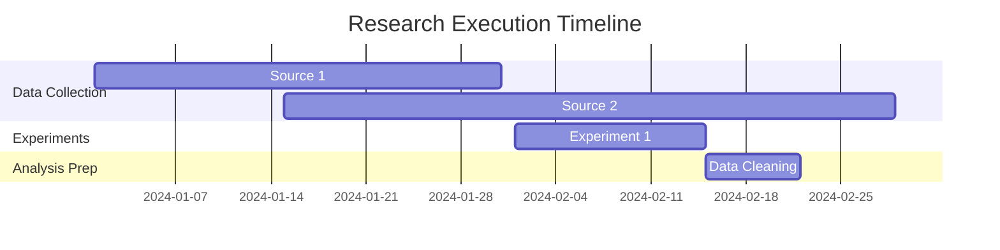

# Research Execution Log

## Execution Overview
- **Start Date**: [DATE]
- **End Date**: [TBD]
- **Status**: In Progress
- **Principal Investigator**: [NAME]
- **Research Topic**: [From definition.md]

## Pre-Execution Checklist
- [ ] Research definition reviewed and approved
- [ ] Methodology finalized and documented
- [ ] Data collection instruments prepared
- [ ] Ethical approvals obtained (if applicable)
- [ ] Resources allocated and available
- [ ] Team briefed on protocols

## Data Collection Progress

### Primary Data Sources

#### Source 1: [NAME]
- **Type**: [Survey/Interview/Observation/Experiment/Database]
- **Status**: ⏳ Pending | 🔄 In Progress | ✅ Complete | ❌ Failed
- **Target Sample Size**: [N]
- **Current Sample Size**: [0]
- **Collection Start**: [DATE]
- **Collection End**: [DATE]
- **Quality Score**: [0-10]
- **Data Location**: `data/raw/[source1]/`
- **Collection Protocol**: [Link to protocol document]
- **Issues Encountered**:
  - None

#### Source 2: [NAME]
[Repeat structure as needed]

### Secondary Data Sources

#### Database 1: [NAME]
- **Access Method**: [API/Download/Request]
- **Status**: ⏳ Pending
- **Records Expected**: [N]
- **Records Retrieved**: [0]
- **Time Period**: [DATE RANGE]
- **Data Location**: `data/raw/[database1]/`
- **Access Issues**:
  - None

## Experiment/Study Execution

### Experiment 1: [TITLE]
- **Type**: [Lab/Field/Computational/Simulation]
- **Status**: ⏳ Pending
- **Start Date**: [DATE]
- **End Date**: [DATE]
- **Participants/Samples**: [N]
- **Conditions**:
  - Control: [Description]
  - Treatment: [Description]
- **Protocol Deviations**:
  - None
- **Raw Data**: `data/raw/experiments/exp1/`
- **Lab Notebook**: `logs/exp1_notebook.md`

## Literature Collection

### Search Strategy Execution
- **Databases Searched**:
  - [ ] Google Scholar
  - [ ] PubMed
  - [ ] Web of Science
  - [ ] [Domain-specific database]
- **Search Queries Used**:
  1. [Query 1]
  2. [Query 2]
- **Date Range**: [YYYY-YYYY]
- **Languages**: [English, etc.]

### Collection Statistics
- **Papers Retrieved**: [N]
- **Papers Screened**: [N]
- **Papers Included**: [N]
- **Papers Excluded**: [N]
- **Exclusion Reasons**:
  - Not relevant: [N]
  - Poor quality: [N]
  - Duplicate: [N]
  - No access: [N]

## Data Quality Monitoring

### Quality Metrics
| Metric | Target | Current | Status |
|--------|--------|---------|--------|
| Completeness | 95% | 0% | 🔴 |
| Accuracy | 99% | 0% | 🔴 |
| Consistency | 100% | 0% | 🔴 |
| Timeliness | On schedule | - | 🟡 |

### Validation Checks
- [ ] Data format consistency
- [ ] Range/boundary checks
- [ ] Missing value assessment
- [ ] Duplicate detection
- [ ] Cross-source validation

## Execution Timeline

## Issues and Resolutions

### Issue Log
| Date | Issue | Severity | Resolution | Status |
|------|-------|----------|------------|--------|
| | | Low/Med/High | | Open/Closed |

## Resource Utilization

### Time Tracking
- **Planned Hours**: [N]
- **Actual Hours**: [N]
- **Variance**: [%]

### Budget Tracking
- **Allocated Budget**: $[N]
- **Spent to Date**: $[N]
- **Remaining**: $[N]

## Protocol Compliance

### Adherence Assessment
- **Methodology Compliance**: [%]
- **Documented Deviations**: [N]
- **Justified Deviations**: [N]
- **Impact on Validity**: [None/Minor/Major]

### Ethical Compliance
- [ ] Informed consent obtained
- [ ] Data privacy maintained
- [ ] Adverse events reported
- [ ] Regular monitoring conducted

## Preliminary Observations

### Emerging Patterns
1. [Initial observation]
2. [Unexpected finding]

### Adjustments Made
1. [Adjustment and rationale]

## Data Backup and Security

### Backup Status
- **Last Backup**: [DATE TIME]
- **Backup Location**: [Location]
- **Verification Status**: ✅ Verified
- **Recovery Test**: [DATE]

### Security Measures
- [ ] Data encrypted at rest
- [ ] Access controls implemented
- [ ] Audit trail maintained
- [ ] Sensitive data anonymized

## Next Steps

### Immediate Actions
1. [Action item 1]
2. [Action item 2]

### Upcoming Milestones
- [ ] Complete data collection by [DATE]
- [ ] Begin data cleaning by [DATE]
- [ ] Start analysis phase by [DATE]

## Sign-off

### Execution Phase Review
- **Reviewed by**: [Name]
- **Date**: [DATE]
- **Status**: ⏳ Pending Review
- **Comments**: [Any review comments]

---

*This document is a living record of the research execution phase. Update regularly to maintain accurate project status.*