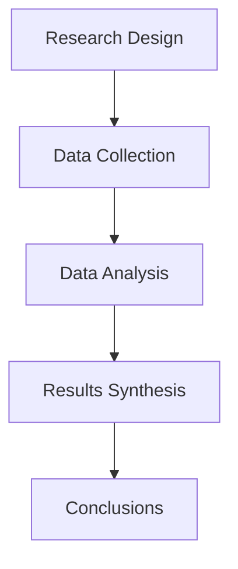

---
# Configure the theme
theme: default
# Use custom background
background: https://source.unsplash.com/collection/94734566/1920x1080
# Apply unocss classes to the current slide
class: text-center
# Highlighting and drawing
highlighter: shiki
# Show line numbers in code blocks
lineNumbers: false
# Persist drawings in exports
drawings:
  persist: false
# Use slide transitions
transition: slide-left
# Use title of the page in the browser tab
title: Research Presentation
# Enable Monaco editor
monaco: true
# Download as PDF or PPT
download: true
# Presentation info
info: |
  ## Research Presentation

  Academic research presentation created with Sli.dev
---

# [Research Title]

  
    Press Space for next slide <carbon:arrow-right class="inline"/>
  

  Authors: [Names]

  Institution: [Organization] | Date: [Presentation Date]

---
transition: fade-out
layout: default
---

# Agenda

### Research Foundation
1. Background & Motivation
2. Research Questions
3. Methodology

### Findings & Impact
4. Key Findings
5. Discussion
6. Conclusions & Recommendations

<v-click>

  Estimated Duration: 20 minutes + Q&A

</v-click>

---
layout: image-right
image: https://source.unsplash.com/collection/94734566/1920x1080
---

# Background

## The Problem

<v-clicks>

- **Issue 1**: [Key problem point 1]
- **Issue 2**: [Key problem point 2]
- **Issue 3**: [Key problem point 3]

</v-clicks>

<v-click>

  <strong>Why This Matters</strong>: [One sentence impact statement]

</v-click>

---
layout: center
class: text-center
---

# Research Questions

<v-clicks>

  1.
  [RQ1 in simple terms]

  2.
  [RQ2 in simple terms]

  3.
  [RQ3 in simple terms]

</v-clicks>

---
layout: two-cols
---

# Methodology

How We Investigated

<v-clicks>

- **Approach**
  - [Research design]

- **Data Sources**
  - [Data sources]

- **Analysis Methods**
  - [Methods used]

- **Timeline**
  - [Study period]

</v-clicks>

::right::

---
layout: fact
---

# Key Findings

Three major discoveries from our research

---
layout: image-left
image: ./figures/finding1.png
---

# Finding 1

## [Finding Title]

<v-clicks>

- **What we found**
  - [Finding statement]

- **Supporting evidence**
  - [Supporting data]

- **Impact**
  - [What this means]

</v-clicks>

<v-click>

  <strong>Key Insight</strong>: [One-line summary]

</v-click>

---
layout: image-left
image: ./figures/finding2.png
---

# Finding 2

## [Finding Title]

<v-clicks>

- **What we found**
  - [Finding statement]

- **Supporting evidence**
  - [Supporting data]

- **Impact**
  - [What this means]

</v-clicks>

<v-click>

  <strong>Key Insight</strong>: [One-line summary]

</v-click>

---
layout: image-left
image: ./figures/finding3.png
---

# Finding 3

## [Finding Title]

<v-clicks>

- **What we found**
  - [Finding statement]

- **Supporting evidence**
  - [Supporting data]

- **Impact**
  - [What this means]

</v-clicks>

<v-click>

  <strong>Key Insight</strong>: [One-line summary]

</v-click>

---
layout: default
---

# Discussion

## What It All Means

<v-click>

  <h3 class="text-green-400 mb-2">✓ Confirms</h3>
  
[What we validated]

</v-click>

<v-click>

  <h3 class="text-yellow-400 mb-2">? Challenges</h3>
  
[What we questioned]

</v-click>

<v-click>

  <h3 class="text-blue-400 mb-2">! Reveals</h3>
  
[What's new]

</v-click>

---
layout: quote
---

# Limitations

Study Boundaries

<v-clicks>

- [Limitation 1]
- [Limitation 2]
- [Limitation 3]

</v-clicks>

<v-click>

  These limitations [do/do not] significantly impact our conclusions

</v-click>

---
layout: statement
---

# Conclusions

<v-clicks>

  1. **Main Conclusion**: [Primary finding]

  2. **Implication**: [What organizations should do]

  3. **Future**: [What comes next]

</v-clicks>

---
layout: default
---

# Recommendations

## Action Items

<v-clicks>

  <h3 class="text-red-400">🔥 Immediate (Now)</h3>
  <ul class="mt-2">
    <li>[Action 1]</li>
  </ul>

  <h3 class="text-yellow-400">📅 Short-term (3-6 months)</h3>
  <ul class="mt-2">
    <li>[Action 2]</li>
  </ul>

  <h3 class="text-blue-400">🎯 Long-term (1+ years)</h3>
  <ul class="mt-2">
    <li>[Action 3]</li>
  </ul>

</v-clicks>

---
layout: default
---

# Future Research

## Next Steps

<v-clicks>

  
🔬

  
[Research direction 1]

  
📊

  
[Research direction 2]

  
🌍

  
[Research direction 3]

</v-clicks>

---
layout: end
class: text-center
---

# Thank You

Questions?

  **Contact**: [Email] 
  **Full Report**: [Where to find it] 
  **Data**: [If publicly available]

---
layout: section
---

# Backup Slides

Additional details for Q&A

---

# [Additional Detail Slide 1]

[Content for deeper dive on specific topics]

---

# [Additional Detail Slide 2]

[Content for deeper dive on specific topics]